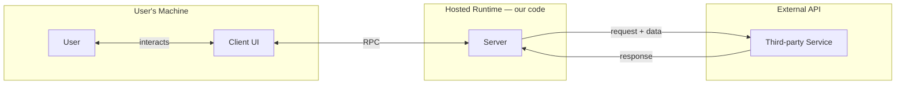

# Application Threat Modeling

## Overview

Build a threat model by making the system visible first, then reasoning about what can go wrong. Always start with architecture diagrams — threats that aren't visible in the diagram will be missed. Use the Mozilla 4-question framework to structure the document.

## Process

### 1. Scope the diagram (ask before drawing)

Ask the human partner two questions before starting:
- **Fidelity**: Should external systems (OAuth, third-party APIs) be shown as distinct named nodes, or collapsed? Low-fidelity is fine early; named nodes are better for identifying distinct attack surfaces.
- **What to include**: Does the system have a CI/CD pipeline, a separate client layer, or other distinct execution contexts? Each distinct trust boundary is worth a separate diagram.

### 2. Draw architecture diagrams (Mermaid in Markdown)

Use `flowchart LR` with subgraph trust boundary zones. Produce **two diagrams**:

| Diagram | What it shows |
|---|---|
| Runtime data flows | Components, trust boundaries, data movement at run time |
| CI/CD pipeline | Code → review → build → deploy path and who/what touches it |

**Trust boundary zones** — use subgraphs with descriptive labels, not generic names:


After drawing, walk through the diagram with the human partner. Correct factual errors before proceeding — a wrong diagram produces wrong threats.

### 3. Apply the Mozilla 4-question framework in order

**Work through all four sections sequentially — do not skip ahead.** Each section grounds the next: you cannot reliably identify threats (Q2) until the assets and data flows (Q1) are accurate, and you cannot write meaningful mitigations (Q3) until the threats are fully described.

| Section | Question | Contents |
|---|---|---|
| 1 | What are we working on? | Assumptions, trust boundaries, components, assets, data flows, dependencies, stakeholders |
| 2 | What can go wrong? | Threats table — ID, name, affected elements, description |
| 3 | What are we going to do about it? | Responses table — threat ID, response ID, strategy, description |
| 4 | Did we do a good enough job? | Review status, open items table |

**Refine Q1 before moving to Q2.** Walk through each sub-section of Q1 with the human partner and confirm it against the diagrams:
- Are all components named and correctly described?
- Does the assets list capture what an attacker would actually want?
- Do the data flows match what was drawn — including directions and what data crosses each boundary?

Only once Q1 feels accurate should you move to threat identification. A wrong or incomplete component/asset/data-flow inventory will produce gaps in the threat list that are hard to catch later.

### 4. Identify threats collaboratively

Don't generate threats silently — work through data flows one by one and surface threats as questions. For each external boundary crossing ask: *what could an attacker do if they controlled the data on this edge?*

Useful probes:
- What happens if the data on this edge is adversarially crafted?
- What does an attacker gain if this component is compromised?
- Can one threat chain into another? (e.g. prompt injection → formula injection)
- What's the worst-case if this credential leaks?

Strategies for the response table: **Reduce**, **Accept**, **Accept + document**, **Transfer**.

### 5. Use consistent ID schemes

```
T1, T2, T3 ...    Threats (numbered in discovery order)
R1, R2, R3 ...    Responses (one threat can have multiple responses)
C1, C2 ...        Components
A1, A2 ...        Assets
F1, F2 ...        Data flows
```

Referencing IDs in PR descriptions and commit messages ("marks T6 as Resolved") creates a durable audit trail.

### 6. Open Items table

Track unresolved work in the document itself:

```markdown
| Priority | Status | Linear | Item | Description |
| --- | --- | --- | --- | --- |
| High | Open | — | Fix T6 | Description of what needs doing (R8) |
| High | Resolved | [AI-56](linear-url) | Fix T6 | Description of what was done |
```

Update this table in the same PR as the fix — not after.

### 7. Iterate on threat descriptions

First-draft descriptions are often too generic. Push deeper by asking:
- What specifically enables this? (the exact function, scope, or credential)
- What does exfiltration actually look like in practice?
- Does this threat chain into another? Document the chain explicitly (e.g. "T9→T6 variant").
- What does *not* count as this threat? (scope boundary — helps reviewers)

### 8. Prioritize by public visibility

If the threat model lives in a public repo, resolve any Open items that give attackers meaningful uplift before committing. A documented-but-unresolved high-severity threat in a public repo is an attack roadmap.

---

## Document structure

```
docs/threat_models/
  ssi-toolkit-threat-model.md       # Tool surface (components, data flows, infra)
  journalist-threat-model.md        # Human surface — threats to the reporting process
  source-threat-model.md            # Human surface — threats to a source's identity
```

Keep tool-surface and human-surface threat models separate. They have different assets, different stakeholders, and different mitigation owners.

---

## Common mistakes

| Mistake | Fix |
|---|---|
| Skipping the diagram and going straight to threats | Always diagram first — invisible components produce invisible threats |
| Jumping to Q2 (threats) before Q1 (components/assets/flows) is fully refined | Threats discovered against an incomplete inventory have gaps; finish and confirm Q1 with the human partner before moving on |
| Generic threat names ("data breach", "injection") | Name the specific function, endpoint, or data flow involved |
| Documenting a threat without a response strategy | Every threat needs at least Accept or Accept + document |
| Updating the threat model separately from the fix | Include threat model update in the same PR as the code change |
| Collapsing all external services into one node | Distinct services have distinct access mechanisms and attack surfaces — name them separately |
| Treating CI as a security gate | Document explicitly that lint/typecheck/tests cannot detect semantically malicious code |

---

## Installation

This file is a draft. To make it available as a personal skill across all projects:

```bash
mkdir -p ~/.claude/skills/application-threat-modeling
cp docs/superpowers/skills/application-threat-modeling.md \
   ~/.claude/skills/application-threat-modeling/SKILL.md
```
