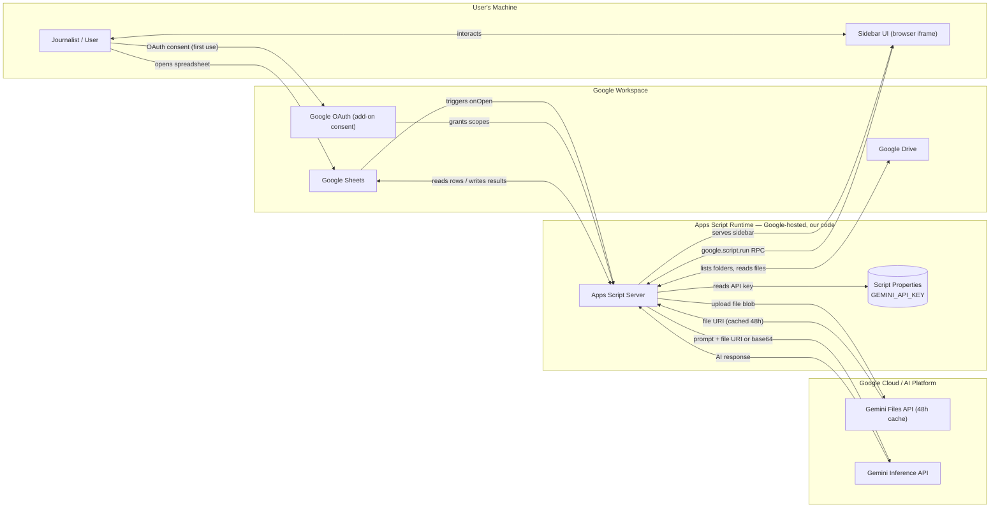
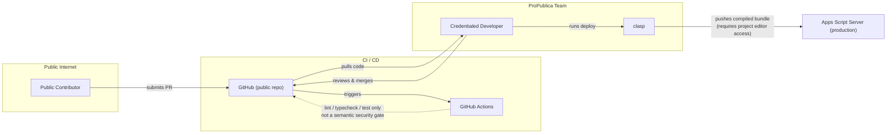

# System Architecture Diagram — Threat Model Design

## Purpose

A low-fidelity security communication artifact: two Mermaid diagrams that map the system's components, trust boundaries, and data flows. Intended for use in security reviews, onboarding, and stakeholder conversations — not a formal STRIDE analysis.

## Scope Decisions

- External systems are shown as distinct named entities (not collapsed into one box) because the access mechanisms and security surfaces differ between them.
- Google Workspace and Google Cloud / AI Platform are separated because they use different access mechanisms: Workspace uses OAuth (user-delegated), GCP uses an API key stored in Script Properties.
- Google Sign-In (basic account authentication to access Sheets) is not shown — it is Google's own authentication layer and not specific to this add-on. The OAuth node represents only the add-on authorization consent.
- Google Docs is not shown as a separate node — OCR temp doc creation/deletion is annotated on the Drive edge.
- The CI/CD pipeline is a separate diagram so each threat surface can be discussed independently.

## Zones / Trust Boundaries

| Zone | What it represents |
| --- | --- |
| User's Machine | Browser where the sidebar iframe runs; user-controlled |
| Apps Script Runtime | Google-hosted V8 runtime running our code; our code, their infrastructure |
| Google Workspace | OAuth consent, Sheets, Drive — accessed via user-delegated OAuth scopes |
| Google Cloud / AI Platform | Gemini Files API and Gemini Inference API — accessed via API key |
| Dev / CI | GitHub, GitHub Actions, credentialed developer, clasp |

## Key Security Observations Surfaced

- **Highest-sensitivity data flow:** The Gemini inference call is the only place where spreadsheet content and Drive file data leaves the user's Google account and reaches an external AI endpoint.
- **Gemini Files API persistence:** File content uploaded to the Gemini Files API is cached on Google Cloud for 48 hours before expiry. This is distinct from the inline base64 path.
- **API key as the GCP access gate:** The `GEMINI_API_KEY` stored in Script Properties is the sole credential granting access to both Gemini APIs. It is not user-scoped.
- **CI is not a security gate:** GitHub Actions runs lint/typecheck/tests only — it cannot detect semantically malicious code. A credentialed developer manually reviewing and deploying is the only human checkpoint between a merged PR and production.
- **Public repo → production path:** A public contributor can submit a PR to the public GitHub repo. If it passes CI and a credentialed developer merges and deploys it without catching malicious intent, that code runs in users' spreadsheets.
- **clasp deployment access:** Deploying requires a Google account with editor/owner access on the Apps Script project — not just Google credentials.

## Diagram 1 — Runtime Data Flows

## Diagram 2 — CI / CD Pipeline

