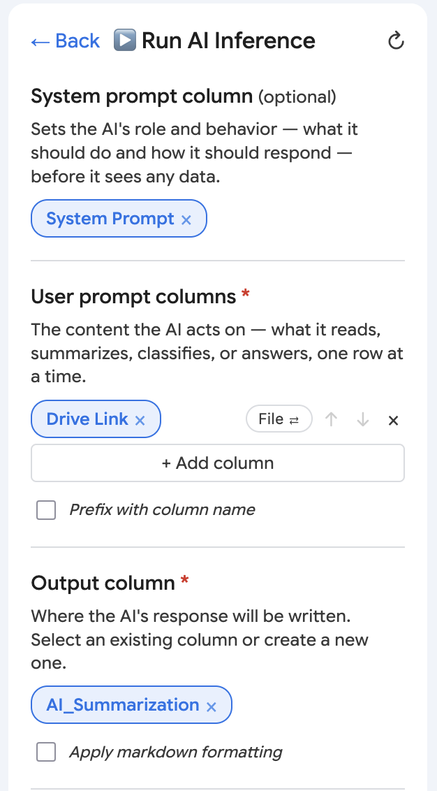
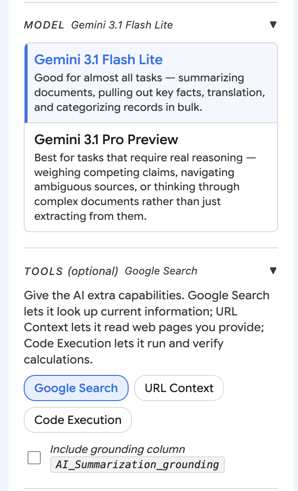
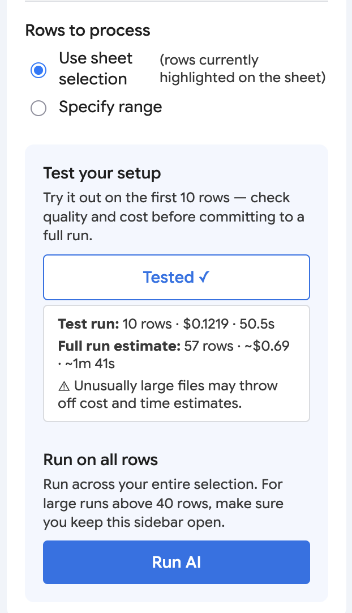
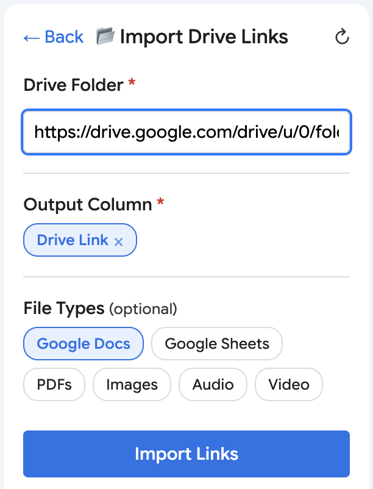
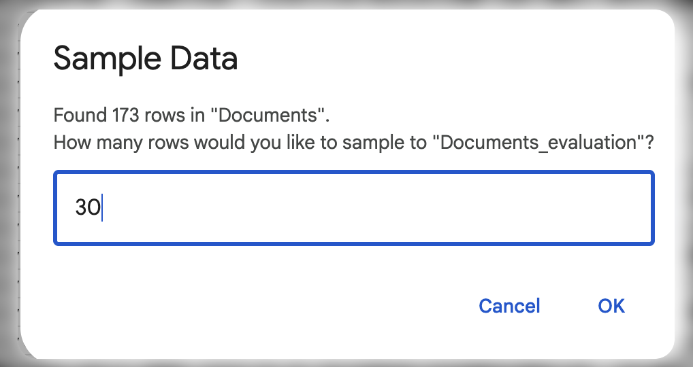
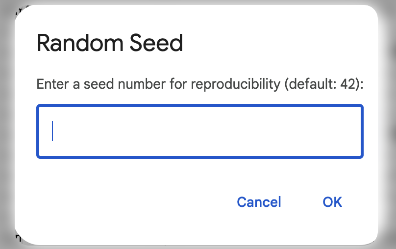
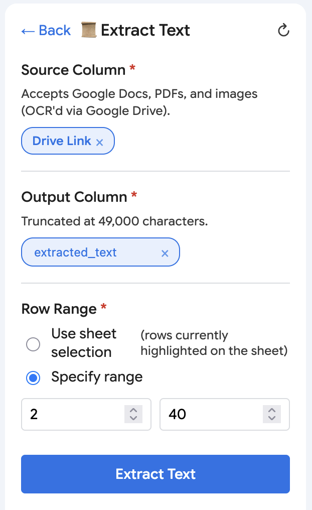

# SSI Toolkit — User Guide

The SSI Toolkit is a Google Sheets sidebar for AI-assisted investigations. This guide walks through each tool available in this alpha round: **Run AI Inference**, **Import Drive Links**, **Sample Rows**, **Extract Text**, and **Format Markdown**.

Recipes (the curated, one-click AI workflows) also appear in the sidebar, but they're still being refined and aren't part of this alpha round — feel free to ignore that button for now.

## Getting oriented

Open the sidebar from the **SSI Toolkit** menu at the top of the Sheet, then click **📐 Open SSI Toolkit**. The sidebar organizes its buttons into two groups:

- **Main Tools** — Recipes (not covered here) and Run AI Inference
- **Extras** — Import Drive Links, Sample Rows, Extract Text, and Format Markdown

## Run AI Inference

Runs a Gemini prompt against each selected row and writes the response into an output column. Supports plain text prompts, file/document inputs from Google Drive, and optional extra capabilities like web search.

**Steps:**

1. Click **▶️ Run AI Inference** from Main Tools.
2. *(Optional)* Choose a **System prompt column** — a column whose text sets the AI's role and behavior before it sees any row data.
3. Add one or more **User prompt columns** — the content the AI actually reads for each row. Click **+ Add column** for more than one, and toggle each between **text** (the column's text is inserted into the prompt) and **file** (the column holds a Drive link, and its file contents are sent to the AI). Check **Prefix with column name** if you want the column name to pass into the AI as a label: `<column name>: <my cell data>`.
4. Choose an **Output column** — pick an existing column or type a new name to create one. Check **Apply markdown formatting** if you want the AI's response rendered with headings/bold/etc. rather than as plain text.
5. *(Optional)* Expand **MODEL** to pick between **Gemini 3.1 Flash Lite** (fast, good for most tasks — summarizing, extraction, translation, bulk categorization) and **Gemini 3.1 Pro Preview** (slower, better for real reasoning over ambiguous or conflicting sources).
6. *(Optional)* Expand **TOOLS** to give the AI extra capabilities: **Google Search** (grounds answers in live web results), **URL Context** (fetches and reads URLs mentioned in the prompt), and **Code Execution** (runs Python for calculations). If you select any tool, you can also check **Include grounding column** to write out an extra column of the sources/citations the AI used alongside its answer.
7. Set **Rows to process**. You have the option of either running the AI on the rows currently highlighted on the sheet, or explicitly setting a start and end row directly.
8. Click **Test** to run just the first 10 rows of your selection. This shows actual cost and time for those rows, plus an estimate for the full run — a good way to check quality and cost before committing.
9. When you're satisfied, click **Run AI** to process every selected row. For runs over 200 rows, you'll see a confirmation dialog with a time estimate — keep the sidebar open until it finishes, since closing it stops the run after the current batch.

**Good to know:**

- The Test button always samples the first 10 rows of your current selection, not a random sample.
- If you change any configuration after testing, the test results are marked stale until you test again.

## Import Drive Links

Recursively lists files from a Google Drive folder into a column, one file link per row.

**Steps:**

1. Click **📂 Import Drive Links** from Extras.
2. Paste a Google Drive folder URL or ID into **Drive Folder**.
3. Choose an **Output Column** — pick an existing column or type a new name to create one.
4. *(Optional)* Under **File Types**, select which kinds to filter by (Google Docs, Google Sheets, PDFs, Images, Audio, Video). Leave blank to include everything.
5. Click **Import Links**.

**Good to know:**

- This tool searches the folder recursively, including subfolders.
- There's no row-range control here — it appends one row per file found, starting from the sheet's next empty row in the output column.

## Sample Rows

Pulls a reproducible random sample of rows from your sheet into a new sheet, useful for testing a prompt on a manageable subset before running it on everything.

**Steps:**

1. Click **🎲 Sample Rows** from Extras.
2. When prompted, enter how many rows you'd like to sample.
3. When prompted for a seed, enter a number (or leave it — it defaults to 42). Using the same seed and sample size always produces the same sample, which is useful if you want to compare prompt changes against an identical set of rows.
4. The tool copies your header row plus the sampled rows into a new sheet named `<your sheet name>_evaluation`, and switches you to it.

**Good to know:**

- This tool works on the entire active sheet — it ignores any cell selection.
- If you run it again with the same seed and sample size against an unchanged sheet, you'll get the same rows.
- Running it again appends to the existing `_evaluation` sheet rather than overwriting it.

## Extract Text

Pulls text out of a Google Doc, PDF, or image (via OCR) linked in a column, and writes the extracted text into another column. Pairs naturally with Import Drive Links.

**Steps:**

1. Click **📜 Extract Text** from Extras.
2. Choose the **Source Column** containing the Drive links to extract from.
3. Choose an **Output Column** — pick an existing column or type a new name to create one.
4. Set the **Row Range**. You have the option of either extracting text from the rows currently highlighted on the sheet, or explicitly setting a start and end row directly.
5. Click **Extract Text**.

**Good to know:**

- Extracted text is truncated at 49,000 characters per cell, a limitation of Google Sheets.
- PDFs and Images are OCR'd via a temporary Google Doc conversion — this can take a few seconds per image.

## Format Markdown

Unlike the other tools, Format Markdown doesn't have its own panel or column pickers — it acts directly on whatever cells you currently have highlighted on the sheet.

**Steps:**

1. On the sheet itself, select the cell or range of cells you want to format — these should contain plain text written with markdown syntax (headings with `#`, `**bold**`, `*italic*`, `~~strikethrough~~`, `` `inline code` ``, links).
2. Click **📝 Format Markdown** from Extras.
3. Each selected cell is rewritten in place with real formatting (headings, bold, italics, etc.) applied — no output column needed.

**Good to know:**

- Because it works on your highlighted selection rather than a configured column, it's easy to click without meaning to — double check your selection first.
- Cells that aren't text, or that don't parse as valid markdown, are left untouched.
- You'll see a confirmation like "Formatted 6 cell(s)" when it finishes.

## Troubleshooting

- **"Row 1 is the header row and can't be processed."** — Your selection or entered row range started at row 1. Reselect or re-enter starting at row 2 or later.
- **"Please select at least one User prompt column." / "Please select an output column."** (Run AI Inference) — A required field was left empty; fill it in and try again.
- **"Please enter a Google Drive folder link."** (Import Drive Links) — The folder field was left blank.
- **"The sheet '\<name\>' appears to be empty."** (Sample Rows) — There are no data rows below the header to sample from.
- **No response after clicking Run AI or Test** — Check that the sheet still has the columns you configured; if a column was renamed or deleted, use the refresh (↻) button in the panel to reload columns.
