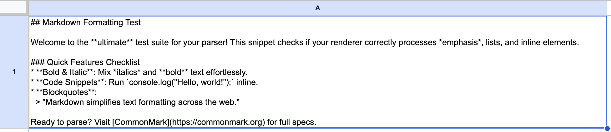
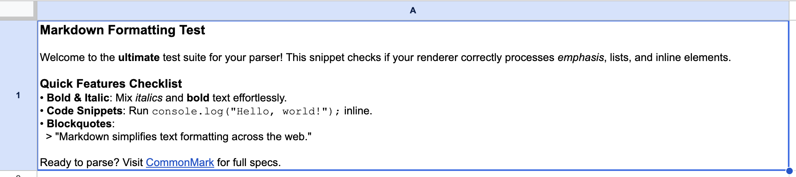

# SSI Toolkit — User Guide

The SSI Toolkit is a Google Sheets sidebar for AI-assisted investigations. This guide covers each tool available in this alpha round: **Run AI Inference**, **Import Drive Links**, **Extract Text**, **Sample Rows**, and **Format Markdown**.

Recipes (the curated, one-click AI workflows) also appear in the sidebar, but they're still being refined and aren't part of this alpha round — feel free to ignore that button for now.

## Installing the add-on

The following directions only apply if your organization distributes SSI Toolkit as a **Google Workspace Editor add-on** (installed once, available across every Sheet you open). If you're working with a **container-bound** copy of the toolkit (attached directly to one specific Sheet), skip ahead to [Getting oriented](#getting-oriented).

1. Open your organization's Marketplace listing for the add-on: `<Marketplace URL — ask your admin>`
2. Click **Install**, and grant the requested permissions when prompted.

## Getting oriented

Open the sidebar using the **📐 Open SSI Toolkit** menu option. If installed as an Editor Add on, the SSI Toolkit will be available as a item under **Extensions**.

This guide covers five tools: **Run AI Inference**, **Import Drive Links**, **Extract Text**, **Sample Rows**, and **Format Markdown**.

## Working the tools together

The sidebar splits the toolkit into "Main Tools" and "Extras," which undersells what the Extras are for: they exist to get your material into the sheet so Run AI Inference has something to work on. The payoff at the end of the chain is an ordinary spreadsheet — one you can sort, filter, and pivot like any other.

Say you have a document dump and you want to research it across a few different categories. Here's how these tools chain together into a sheet you can actually work:

1. **Import the documents into the sheet.** Import Drive Links turns a Drive folder into one row per document.
2. **Extract the text.** Extract Text puts the words in the sheet. This is your grounding surface — the thing you check the AI's answers against later.
3. **Decide what you're pulling out, and draft a first-pass prompt.** A chatbot is genuinely useful here. Describe your documents and what you need, and get the wording roughly right before bringing it into the sheet.
4. **Run AI Inference — Test first.** Read the output on those rows, revise the prompt, and test again. Every row is a separate paid API call, so iterate on a handful of rows rather than on the full dataset — a prompt you fix after 5,000 rows costs you 5,000 rows twice. Reach for Sample Rows when you want a fixed subset to iterate against, so successive attempts are comparable. Then run the full set.
5. **Use spreadsheet functions to split and ground the output.** Pull the individual categories out of the AI's answer into their own columns. Then add a column that checks each claim against the extracted text — a `SEARCH()` against the source column will tell you whether a quoted sentence actually appears in the document.
6. **Filter, sort, pivot, report.**

## Don't forget about other spreadsheet tools

SSI is best leveraged in conjunction with all the trappings of traditional spreadsheet work. Don't forget about [functions](https://support.google.com/docs/table/25273?hl=en) (`=IF()`, `=CONCAT()`, etc), column [filters and sorts](https://support.google.com/docs/answer/3540681?hl=en&co=GENIE.Platform%3DDesktop), [data validation rules](https://spreadsheetpoint.com/data-validation-google-sheets/), your [conditional formatting](https://support.google.com/docs/answer/78413?hl=en&co=GENIE.Platform%3DDesktop), [pivot tables](https://support.google.com/docs/answer/1272900?hl=en&co=GENIE.Platform%3DDesktop), etc. These remain powerful tools in your toolkit. The more you use them, the more likely you are to get reliable results. Remember, **we get better results when we ask the AI to do less**.

And don't forget about existing AI-powered features of Google Sheets. The [`=AI()` function](https://support.google.com/docs/answer/15877199?hl=en) lacks the full featureset of the SSI Toolkit, but is still great for simple text classification or other small tasks — and it's free to use, subject to usage limits. The embedded Gemini chat window is great for helping write those thorny spreadsheet functions like `=IFERROR(SPLIT(REGEXREPLACE($O11, "[\s\S]*?""contextual_snippet"":\s*""([^""]+)""|[\s\S]+", "$1|"), "|"), "")`

## ▶️ Run AI Inference

<!--  -->

Sends a Gemini prompt for each row and writes the answer into an output column. Clicking it opens a configuration panel — nothing runs until you press **Test** or **Run AI**.

### When to reach for this

The task is the same question asked once per row: summarize, classify, extract a field, translate, check against a rule. It's the wrong tool for a question about the dataset as a whole, because each row is an independent request that knows nothing about the other rows.

### The three components of AI inference

#### 1. Set your columns

Three columns do three different jobs, and the panel explains each as you fill it in. What it doesn't tell you:

**Text or file.** Each user prompt column carries a small toggle reading `Text ⇄` or `File ⇄`. In **text** mode the cell's characters are sent as they are — so a cell holding a Drive URL sends the AI the URL itself, which it cannot open. In **file** mode the cell is treated as a Drive link: the document is fetched and its contents are sent. Google Docs are converted to PDF and Google Sheets to CSV on the way.

**Order matters.** The `↑` and `↓` buttons change the order the AI receives your columns in.

Checking **Apply markdown formatting** turns the response into real rich text instead of leaving `**asterisks**` sitting in the cell.

#### 2. AI configuration

Choose a model and tools based on what the task needs. The panel describes each model when you expand the section.

For tools: reach for **URL Context** when your own cells contain links you want read, **Google Search** when the answer isn't in your data at all, and **Code Execution** for arithmetic you'd rather not have the model do in its head.

#### 3. Run

**Test** runs the first 10 rows of your range and reports what those rows actually cost and how long they took, plus a projection for the full run. Use it whenever the prompt is new, the model changed, or you've added a tool — and skip it only when you're re-running a setup you've already validated. Change any setting after testing and the results are marked stale until you test again.

**Run AI** then processes every row in your range.

### Tips & gotchas

- **Fill your system prompt down every row.** It's read from each row's own cell, so an instruction typed only into row 2 means every row after it runs with no system prompt at all — silently, with no warning, and returning output that looks perfectly plausible.
- **Rows with nothing in the prompt columns are skipped, not blanked.** The output cell is left exactly as it was, so a leftover value from an earlier run stays put and reads like a fresh answer.
- **Turn on "Prefix with column name" when you feed more than one text column.** It sends each value as `Column name: value` so the AI can tell them apart. Without it, several columns arrive as one undifferentiated block of text.
- **Ask for a constrained answer when you plan to filter.** "Reply only YES, NO, or UNCLEAR" gives you a column you can sort, filter, and pivot. An open-ended question gives you a paragraph you have to read.
- **Point Test at the rows you actually care about.** It takes the first 10 rows of your selection, not a random 10 — so highlight a range starting at a document you know is difficult rather than accepting rows 2–11.
- **Test is not a dry run.** It performs real inference, costs real money, and writes real answers into the output column for those 10 rows.
- **Add a second column for evidence.** Run again asking for the verbatim sentence that supports the answer. Spot-checking then means reading two cells side by side instead of reopening the source document.
- **Extract text first when your documents are text-heavy.** Extracted text is cheaper to send, reusable across runs, searchable in the sheet, and gives you something to check the AI against. Reach for file mode when layout, tables, or images carry the meaning.
- **Google Search costs real money per query.** It's billed at $14 per 1,000 searches — about 1.4 cents each, and a single row can issue more than one. That dwarfs the token cost on Flash Lite, so switching Search on for 5,000 rows is a different decision than for 50. The cost shown also assumes you pay for every query; Google's free monthly grounding allowance is invisible to the add-on, so your real bill may be lower.
- **Don't ask the AI to write formulas.** An answer starting with `=`, `+`, or `-` lands as plain text with an apostrophe in front of it. An answer containing `IMAGE()` or any `IMPORT…()` function is thrown out entirely and replaced with an error — a deliberate guard against a malicious document rewriting your sheet.
- **The output column turns orange and yellow on purpose.** The header gets an orange fill and a note reading "Some cells in this column may be AI-generated"; the answer cells get a pale yellow tint. That's a reminder, not a bug.
- **To stop a run, hit the ✕ at the bottom of the sidebar.** It won't stop on the spot — the toolkit sends rows to the AI in batches of 40, so it finishes the batch it's on first, and up to 39 more rows may still fill in. Closing the sidebar behaves the same way.
- **A failed file leaves an error in the cell.** If a row's Drive file can't be downloaded, `[File error: …]` is written to its output cell and no inference is attempted for that row.
- **A new output column lands at the far right of the sheet**, past every existing column — not beside your data.
- **Watch the row range.** Choosing "Specify range" but leaving either box empty quietly falls back to your highlighted selection. Entering a start row higher than the end row produces the misleading alert "Row 1 is the header row and can't be processed." Row 1 is never processed under any setting.
- **Renamed or deleted a column mid-session?** Hit ↻ in the panel header to reload the column list.

## 📂 Import Drive Links

<!--  -->

Walks a Google Drive folder and every subfolder beneath it, writing one file link per row into a column.

### When to reach for this

You have a folder of documents and need them as rows before you can extract text or run AI over them. This is usually the first step of a document-dump investigation.

### Tips & gotchas

- **It overwrites, starting at row 2.** Writing begins at row 2 of the output column and continues down for as many files as it finds, replacing whatever was there. Point it at a column that already holds data and that data is gone.
- **It recurses into every subfolder.** A folder of folders returns everything underneath it, flattened into a single column with no indication of which subfolder each file came from.
- **You can't choose how many rows you get.** There's no row range — the row count is however many files it finds.
- **Split a mixed dump by running it once per file type.** The File Types filter matches by category, so "Images" catches every image format. Selecting nothing at all includes every file.

## 📜 Extract Text

<!--  -->

Reads the Drive link in each row and writes that document's text into another column. Google Docs are read directly; PDFs and images go through OCR.

### When to reach for this

You want the words themselves in the sheet — searchable with Ctrl+F, filterable, and usable as a text prompt column. Typically this runs right after Import Drive Links. Skip it if you plan to use file mode in Run AI Inference, which sends documents to the model directly.

### Tips & gotchas

- **Long documents are cut off mid-sentence.** The panel's 49,000-character cap is a Google Sheets limit, and a truncated cell ends with `... [TRUNCATED]`. Nothing else flags it, so don't assume a cell holds a whole document — search the column for that marker before running AI over it.
- **Only three kinds of file work.** Google Docs, PDFs, and images. Everything else — Google Sheets, `.docx`, plain text, audio, video — writes the literal string `[Skipped: Unsupported Type]` into the cell. Filter for that string before trusting the results.
- **Rows without a recognizable Drive link are skipped in silence.** No error, and the output cell is left untouched. A link only counts if it looks like a Drive URL, so a bare file ID pasted without the surrounding URL is ignored.
- **Once it starts, it finishes.** Unlike an AI run, extraction isn't batched — hitting ✕ won't halt it, and every row in your range still gets processed. Rows are written one at a time so you can watch it go, but you can't call it off. Start with a small row range.
- **Give it time.** Google Docs are read directly and come back quickly. PDFs and images have to be converted before their text can be read, so they take noticeably longer — budget real time for a folder of a few hundred scans.
- **"Setup Required" means the Drive service is off.** Enable the Drive API in the Apps Script editor's Services list.

## 🎲 Sample Rows

<!--  -->

Asks how many rows you want, then asks for a seed, then copies your header row plus that many randomly chosen rows into a new sheet named `<your sheet name>_evaluation` and switches you to it. There's no panel — two dialogs, and then you're on a new sheet.

### When to reach for this

Spot-checking. Pull a manageable subset, run a prompt against it, and read the results by hand before committing to the full dataset.

### Tips & gotchas

- **Write the seed down.** The same seed and sample size against an unchanged sheet always returns the same rows, which is how you compare two prompt versions on identical data. Change the seed to draw a different sample of the same size.
- **Running it again appends — it doesn't replace.** A second run adds to the existing `_evaluation` sheet, so repeated runs accumulate, and repeating with the same seed and size accumulates duplicates. Delete or rename the sheet first if you want a clean sample.
- **The header row is copied only when the sheet is first created.**
- **A non-numeric seed, or `0`, silently becomes 42.**
- **It ignores your selection entirely** and samples the whole active sheet. The sample size has to be between 1 and the number of data rows.

## 📝 Format Markdown

<!--  -->

Rewrites your currently highlighted cells in place, turning markdown syntax into real formatting. No panel, no column pickers, no confirmation — it acts the moment you click.

### When to reach for this

A run came back full of `**asterisks**` and `## hashes` as literal text because "Apply markdown formatting" was switched off.

### Tips & gotchas

- **Check what's highlighted first.** There's no panel and no confirmation, so it's easy to click with the wrong range selected.
- **The original markdown characters are gone afterward.** The cell is rewritten in place, and undo is the only way back.
- **A lower count than you expected doesn't mean it failed.** "Formatted 6 cell(s)" counts only the cells it actually changed — non-text cells, empty cells, and cells that don't parse as markdown are left untouched and not counted.
